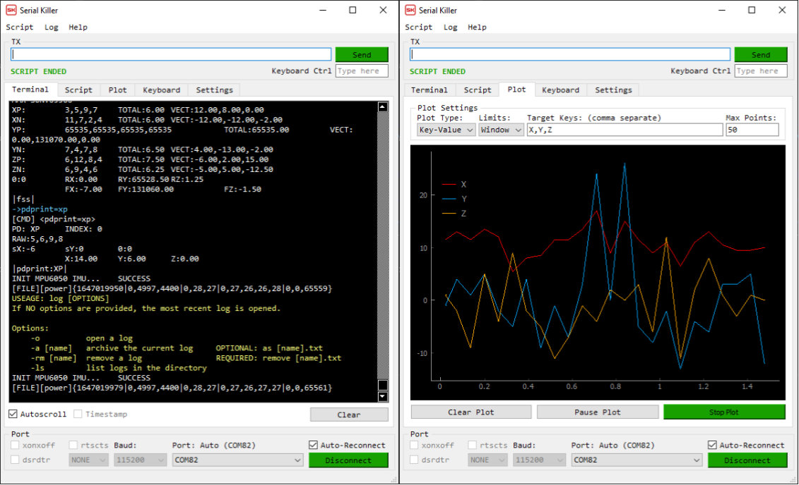

# Serial Killer - A killer serial terminal
An open source Serial Terminal, with a host of features for automation and simplicity. 




Current Features:
- "Command line" style control
  -  Quickly connect to a port, clear the terminal or access a number of other features with a handful of commands, entered directly in the output text box. 
- Auto-Rescan - Any change in available serial ports is immediately displayed.
- Auto-Reconnect - Reconnect to a port as soon as it appears. 
- Auto-Save - User settings are remembered between program loads.
- Text Color Highlighting - Inputs, outputs, etc. are colored differently to make communication clear. 
- Logging - All input/output is saved by default to a timestamped log file.
  - Recover data when the terminal is cleared or the program closed. 
  - Interleave data from multiple ports at one time. 
  - Create custom log formats to export formatted data.
- Custom Single-key press controls
  - Tie single key presses to messages sent to the device. 
- Scripting - Automate an interface, run tests or configure the UI with basic scripting files.
  - The K.I.S.S. scripting syntax has a minimal number of features but supports looping, custom arguments, delays, and other commands. 
- Plotting - Graph data as it is received. 
  - Use custom filters to remove irrelevant data. 
  - Set custom plot limits and sizes. 
  - Use features built into pyqtgraph to export plot images, transform data, etc. 

# Install: 

<details open>


Ensure the following packages are installed:
- Pip 
- Python > 3.8

Run serial_killer.py from a terminal.  
If imports are unsuccessful, you will be prompted to auto-install packages.  

## For Linux
For Linux use, the user needs access to the serial ports. This is done with:

> $ sudo adduser <your_username> dialout

check you are added to the group: 

> & groups 

Your computer will need to be restarted in order for this change to take effect.

</details>

# Run: 

With Python >= 3.8, run `serial_killer.py`  

# Usage:

## General

<details open>

### Text Input
Use the 'TX' text box at the top of the window both as a way to send text to the device, and as a way to enter commands. 

This text is only sent after pressing 'Send' or hitting `ENTER`. 

To append a newline or return character (as is common with serial messages) to this text, edit the string defined in `Settings > Append to Send:`. The text here will be appended to everything sent. 


Because some characters like `tab` and `newline` cannot be typed with the `TAB` and `ENTER` keys, an option is provided to interpret "\t", "\n", and "\r" in the input with their corresponding control characters. As with other text interpretation, "\\\n", "\\\t", and "\\\r" are replaced with literal \n, \t ,\r. 

If enabled, this would mean that:
```
hello\tworld \n i am on a newline \\n i am not
```
is sent as:
```
hello   world 
 i am on a newline \n i am not
```


</details>

## Commands

<details open>
</details>

## Scripts

<details open>
</details>

## Logs

<details open>
</details>

## Plotting

<details open>
</details>

## Settings

<details open>
</details>


# Possible Future Features / Fixes

## Plots
- Add plot types for parsing and plotting arrays and single variables
- Add flexible input parsing, separators, etc. for plot data. 
- Add multiple scale plotting. 

## Scripting 
- Integrate python scripts directly in the script tab. I have done some experiments using python's eval() and exec() functionality, but I ran into bugs that looked too time consuming to address.  

## Serial
- Add encodings other than 'utf-8' for input and output.

## Commands 
- Additional Commands for changing settings
- Adding escape character to command parser

# Modification / Under the hood

## GUI

[PyQt5](https://pypi.org/project/PyQt5/) is the framework for GUI development. 

Use [QtDesigner](https://doc.qt.io/qt-5/qtdesigner-manual.html) to modify the GUI. 

The `.ui` needed for QtDesigner are found in the [/ui_files](/ui_files) folder. These files are translated into python files using the `pyuic5` tool. The outputs of these translations are found in the [/gui](/gui/) folder. 

To modify the GUI, do the following steps:

1. Open the .ui file in QtDesigner. 
2. Make modifications.
3. Save the file.
4. Update the python files in the /gui folder. This can be done one of two ways:
   - Run Serial Killer with the argument '-u'
> py serial_killer.py -u
   - OR Update things manually:
> pyuic5 -o gui/GUI_MAIN_WINDOW.py ui_files/serial_killer_main_window.ui   
> pyuic5 -o gui/GUI_LOG_POPUP.py ui_files/serial_killer_log_popup.ui   
> pyuic5 -o gui/GUI_HELP_POPUP.py ui_files/serial_killer_help_popup.ui   
5. Run Serial Killer 

